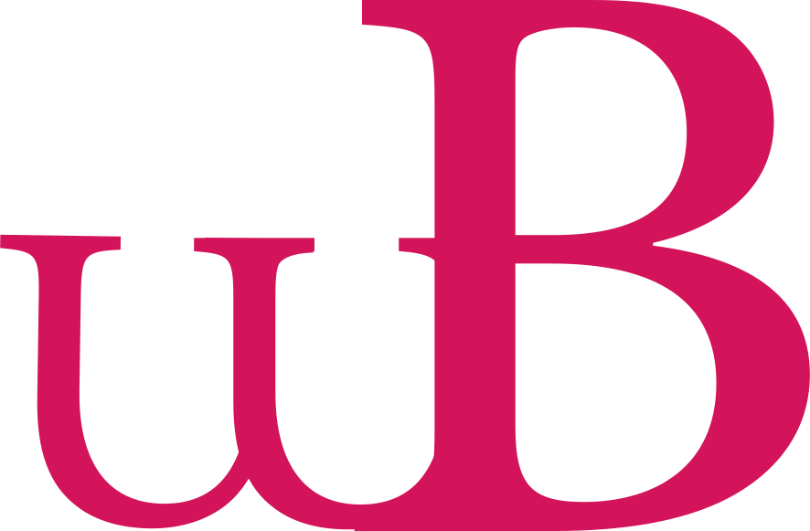
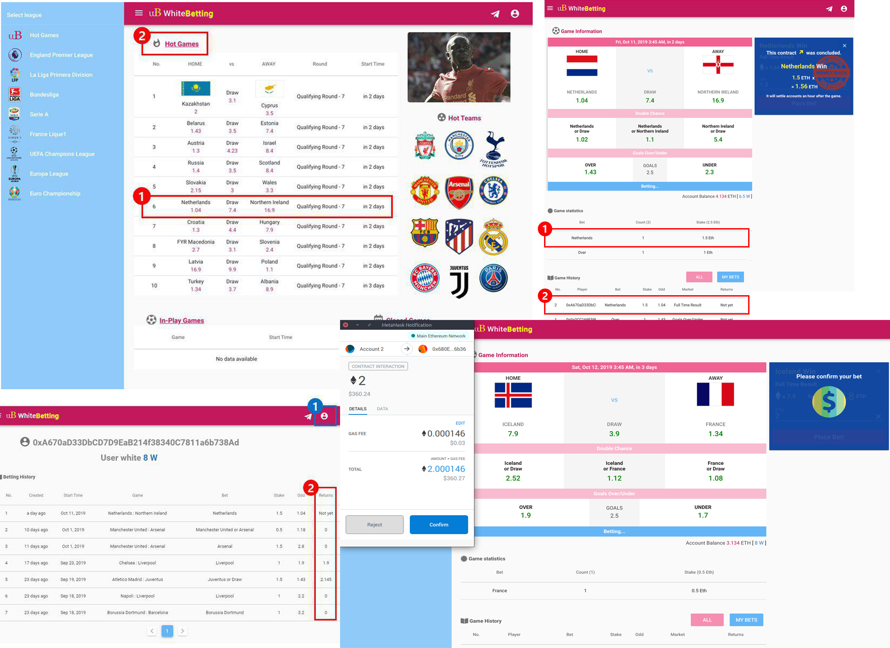

<h1 align="center"> WhiteBetting </h1>

<div align="center">
  <a href='https://wb.himion.com/'>https://wb.himion.com</a>
  <div> </img> </div>
  <br/>
  <em> World's first European football betting game on ethereum blockchain </em>
  <br />
  <em> The way I love football. Cheer with WhtieBetting! </em>
</div>

## Screenshot

## Summary
1. Strategize against the odds, then bet Ethereum on the match of your choice
1. At the end of the match, automatically rewarded via smart contract based on the outcome
1. Transparent betting history for all accounts

## History
<div>
2019.03.02 <span style='margin-left:10px;'>MVP version created</span></br>
2019.06.22 <span style='margin-left:10px;'>Ropsten testnet goes live</span></br>
2019.09.23 <span style='margin-left:10px;'>Mainnet goes live</span></br>
2019.10.19 <span style='margin-left:10px;'>Hack occurred. 128ETH stolen</span></br>
2019.11.03 <span style='margin-left:10px;'>First sales occurred. Marketing scam. 2.5ETH lost</span></br>
2019.11.27 <span style='margin-left:10px;'>Main banner ad on Dapp.com (#2 Dapp portal)</span></br>
2019.12.02 <span style='margin-left:10px;'>Ranking ad on DappRadar (#1 Dapp portal)</span></br>
2020.03.12 <span style='margin-left:10px;'>Corona outbreak - world's top 5 football leagues, including Premier League, suspend service</span></br>
</div>


## Business Reviews
I started an offshore football betting service without ever gambling before. Everything was clumsy and hard, and I kept losing Ethereum as I went along. People who won ETH kept coming back, and people who lost it never came back. 

The blockchain world was full of scammers. Servers were hacked, and I was scammed here and there for publicity. 
On top of that, the cost of Ethereum gas fluctuated daily. One day it was 2 cent, another day it was 1 dollar. 

I barely slept during the six months I was running the service. My parents were always worried. My red eyes and puffy dark circles were so deeply imprinted that it seemed like they would never go away. And then the coronavirus canceled all football leagues.

Services were suspended. 100K dollars in the red. That was probably the most incredible year of my life, building something in the world. Too bad it was just a gambling site. I will never risk my life on something like that again. That's why I'm making this service fully public.


## Libraries
1. Dividends | <a href='https://www.api-football.com/'>api-football</a> API key required
1. web3 | <a href='https://www.infura.io/'>infura</a> API key required
1. Contract | <a href='https://etherscan.io/address/0x07859fec7b937c695f1f807255cfc4a13c7b7138#code'>solidity code</a>
1. Betting | <a href='https://metamask.io/'>MetaMask</a> or <a href='https://trustwallet.com/'>TrushWallet</a>
1. Notifications | <a href='https://slack.com/'>slack push</a> Slack notifications require an API key
1. Logs | <a href='https://etherscan.io/'>etherscan</a>

---

## 서비스
1. 배당률에 맞게 전략을 세운 후, 원하는 경기에 이더리움을 베팅
1. 경기가 끝나면 결과에 따라 스마트 컨트랙을 통해 자동 보상
1. 모든 계정의 베팅 기록을 투명하게 공개

## 서비스 연혁
<div>
2019.03.02 <span style='margin-left:10px;'>MVP 제작 </span></br>
2019.06.22 <span style='margin-left:10px;'>Ropsten 테스트넷 서비스 시작</span></br>
2019.09.23 <span style='margin-left:10px;'>메인넷 실서비스 시작</span></br>
2019.10.19 <span style='margin-left:10px;'>해킹 발생. 128ETH 탈취 당함</span></br>
2019.11.03 <span style='margin-left:10px;'>첫 매출 발생. 마케팅 사기 당함. 2.5ETH 손실</span></br>
2019.11.27 <span style='margin-left:10px;'>Dapp.com(Dapp포탈 2위) 메인 배너광고</span></br>
2019.12.02 <span style='margin-left:10px;'>DappRadar(Dapp포탈 1위) 랭킹 광고</span></br>
2020.03.12 <span style='margin-left:10px;'>코로나 발발 - 프리미어를 비롯한 세계 5대 축구 리그 중단으로 서비스 중단</span></br>
</div>

## 사업후기
한번도 도박을 해본적도 없으면서 시작했던 해외축구 베팅 서비스. 모든 것이 서툴고 힘들었다. 사업을 진행할수록 계속 이더리움을 잃었다. 이더리움을 딴 사람들은 계속 방문했고 잃은 사람들은 다시 오지 않았다. 

블록체인 판은 사기꾼 천지였다. 서버를 해킹당하고 홍보를 미끼로 여기저기서 사기를 당했다. 
게다가 이더리움 가스비는 매일 출렁거렸다. 어느 날은 30원이었고 어느 날은 1300원이었다. 

서비스를 진행했던 6개월간 거의 잠을 자지 못했다. 부모님은 항상 걱정하셨다. 붉은 눈과 늘어진 다크서클이 너무 진하게 각인되어 영원히 없어질 것 같지 않았다. 그리고 코로나로 모든 축구 리그가 중지되었다.

서비스도 중지되었다. 적자 1억. 그 1년이 아마도 내 인생에서 가장 믿을 수 없을만큼 세상에 무언가를 빌드했던 시기였다. 아쉬운건 그것이 겨우 도박 사이트였다는 것이다. 다시는 그런것에 내 인생을 걸지 않을 것이다. 그런 의미로 이 서비스를 완전 공개한다.
## 외부 라이브러리
1. 배당 | <a href='https://www.api-football.com/'>api-football</a> api키 필요
1. web3 | <a href='https://www.infura.io/'>infura</a> api키 필요
1. Contract | <a href='https://etherscan.io/address/0x07859fec7b937c695f1f807255cfc4a13c7b7138#code'>solidity code</a>
1. 베팅 | <a href='https://metamask.io/'>MetaMask</a> or <a href='https://trustwallet.com/'>TrushWallet</a>
1. 알림 | <a href='https://slack.com/'>slack push</a> 슬랙 알림시 api키 필요
1. 로그 | <a href='https://etherscan.io/'>etherscan</a>

## Install
```bash
npm i
cd client
npm i
```
### MongoDB 
`sudo mongod --dbpath "몽고db 저장위치" --port "db 포트번호"`
```bash
sudo mongod --dbpath /database/WhiteBetting --port 28882
```

## Run
* development
```bash
npm run start
cd client
npm run serve
```
* product
If you don't have a build version - if you don't have a public folder created,
```bash
cd client
npm run build
cd ..

npm run start
```
If you already have a build version,
```bash
npm run start
```

Then browse to `http://127.0.0.1:10001`

